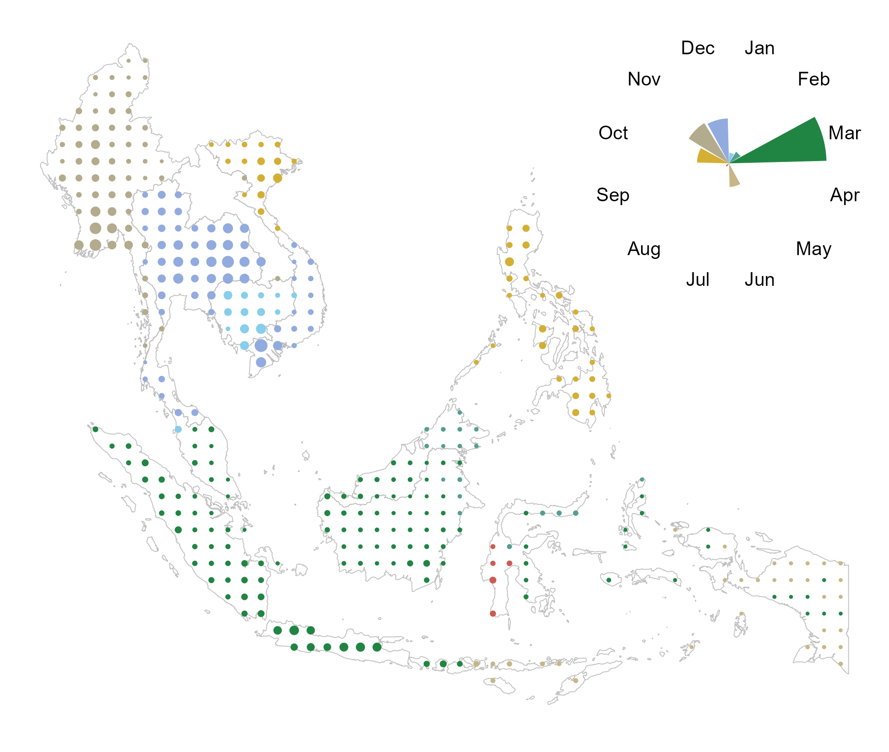
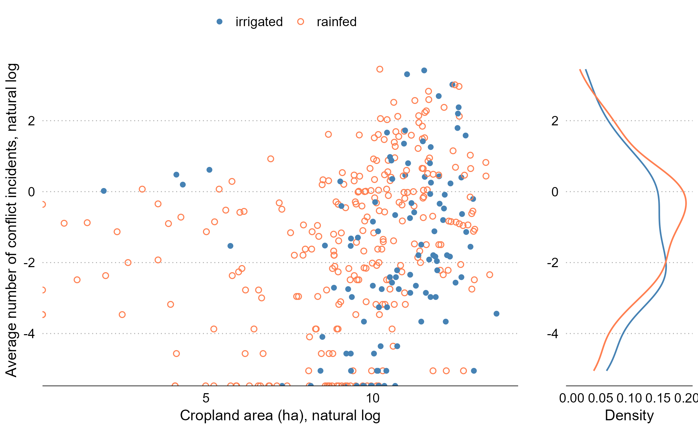
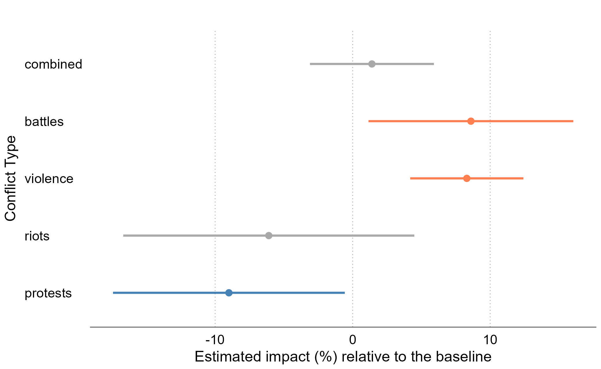
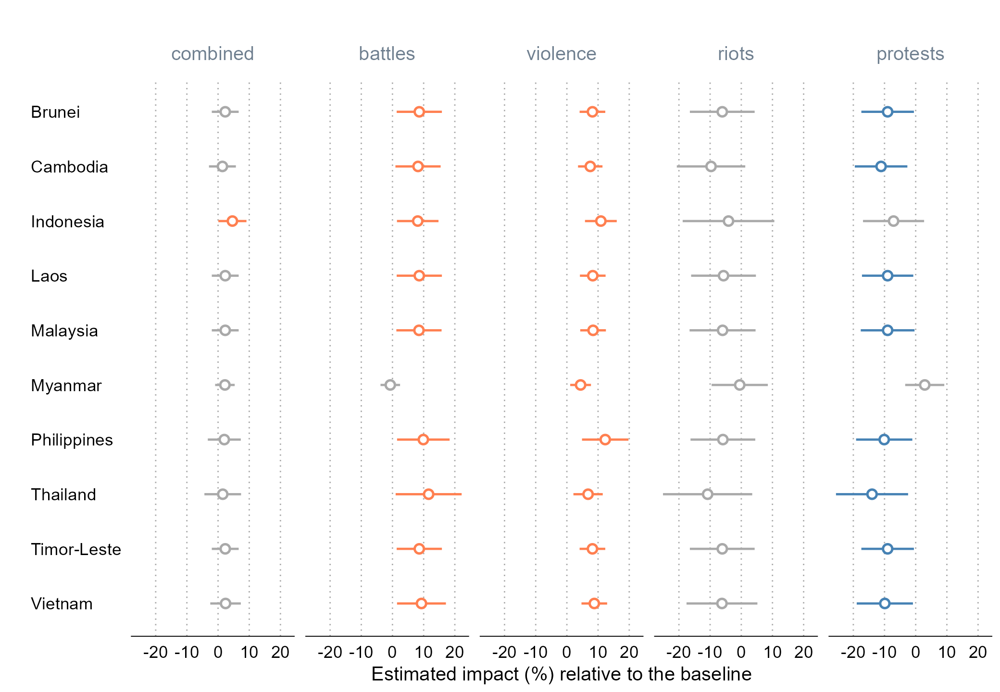
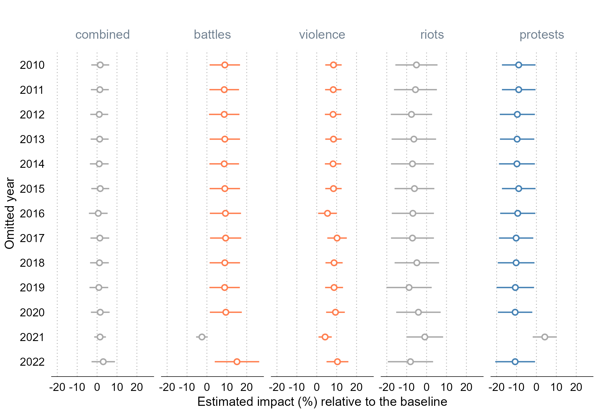
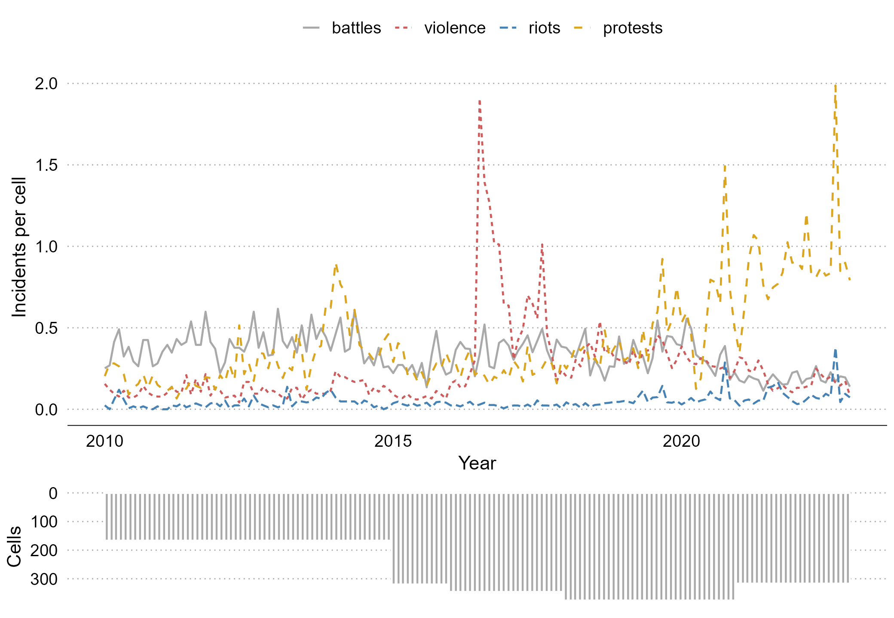
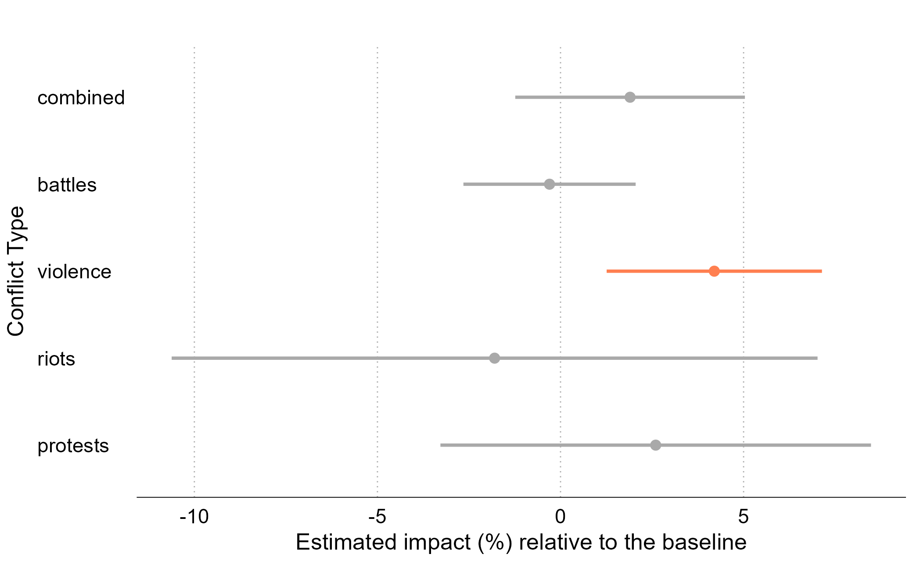
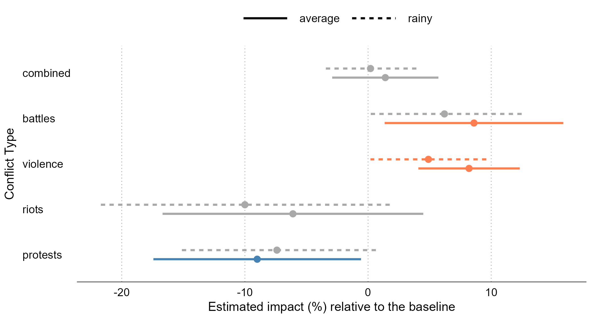
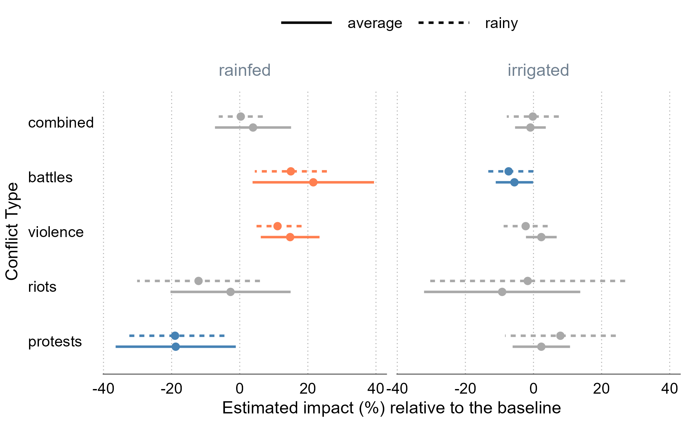

```{r setup, include=FALSE}
knitr::opts_chunk$set(echo = FALSE)
```

# Do harvest-time agricultural shocks affect conflict?

.right-column[

Conflicts happen... everywhere and all the time. 

But in some places and at certain times more of them happen.

We focus on low- and middle-income countries of Southeast Asia, where agriculture employs and pays large shares of population, and ask the question:

> Do harvest-time agricultural shocks lead to changes in forms of conflict?

]


---


# They amplify violence and (maybe) reduce protests

.right-column[

The answer to the research question is hardly unequivocal.

Relative to the rest of the year, at harvest time we observe:
- four-to-eight percent increase in violence against civilians
- up to ten percent decrease in protests*
- excess rain during the growing season mitigates the effects
- the results are mainly driven by rainfed locations

$$\\[.5in]$$

*sensitive to data subsetting.

]


---


# Conflicts happen all across Southeast Asia

.left-half[

From the [ACLED Project](https://acleddata.com/), over 70 thousand incidents of: 
- <span style="color:dimgray">**battles**</span>, 
- <span style="color:dimgray">**explosions/remote violence**</span>, 
- <span style="color:indianred">**violence against civilians**</span>, 
- <span style="color:goldenrod">**riots**</span>, and 
- <span style="color:goldenrod">**protests**</span> 

observed over the 2010-2022 period.

]

.right-half[

]

---


# Conflicts happen all the time in Southeast Asia

.pull-left[

Unbalanced panel of eight countries.

For most countries, the data are available from 2010 onward, except for:

- Indonesia (2015-)
- Philippines (2016-)
- Malaysia (2018-)

]

.pull-right[

]

---


# Rice is cultivated across all of Southeast Asia

.left-half[

From IFPRI's [Spatial Production Allocation Model](https://dataverse.harvard.edu/dataset.xhtml?persistentId=doi:10.7910/DVN/PRFF8V) (SPAM) and [Monfreda et al. (2008)](https://agupubs.onlinelibrary.wiley.com/doi/10.1029/2007GB002947),
- regional variation in harvested areas
- regional variation in harvest seasons
- regional variation in proportion of irrigated land

]

.right-half[

]

---


# Positive correlation between conflict and croplands

.pull-right[

]

---


# We study the effect of harvest on forms of conflict

.right-column[

The outcome variable is the number of conflict incidents observed at a cell in a given time. We consider:
- each form of conflict separately,
- all forms of conflict combined.

The treatment variable is the product of the cell-specific area (hectares) and harvest season (binary).

Fixed effects: cell, country $\times$ year, year-month.

]


---

# Battles and violence increase and protests decrease

.right-column[



]

---


# Myanmar seems to be driving (some of) the results

.pull-right[



]

---


# 2021 seems to be driving (some of) the results

.pull-right[



]

---


# Conflict series look sensible w/o Myanmar 2021-2022

.pull-left[
Full sample consists of 44,724 observations and 71,109 incidents.

Myanmar 2021-2022 includes 1,416 (3.2%) observations and 23,550 (33.1%) conflict incidents.

]

.pull-right[



]

---


# Violence increases (and nothing else changes)

.right-column[



]

---


# Harvest-time violence may be linked to rapacity

.right-column[

[Ubilava et al. (2023)](https://doi.org/10.1111/ajae.12364) investigate the effect of cereal price change on seasonal violence in the croplands of Africa.

The key finding: much of the annually accrued effect&mdash;which is positive, statistically significant, and economically meaningful&mdash;happens during the first three months of the crop year.

Accords with the *rapacity mechanism*: farmers attacked when most gains are to be made (or maximum damage incurred).

]

---


# Opportunity cost may explain less protests 

.right-column[
The *opportunity cost mechanism* often is portrayed as a trade-off a person faces between farming and fighting.

Agricultural shocks may push a person in one direction or another... but this is a longer term engagement.

In the short run, the opportunity cost mechanism is well-suited to explain the lack of protests at harvest time.
]

---


# Excessive rainfall mitigates the effects 

.right-column[

]

---

# Much of the effect comes from rainfed locations 

.right-column[

]

---

# We contribute to three strands of literature

.right-column[

Climate shocks and conflict ([Burke et al., 2009](https://www.pnas.org/doi/pdf/10.1073/pnas.0907998106); [Hsiang et al., 2013](https://www.science.org/doi/10.1126/science.1235367); [Crost et al., 2018](https://www.sciencedirect.com/science/article/abs/pii/S0095069617301584))

Economic roots of conflict ([Berman et al, 2011](https://journals.sagepub.com/doi/10.1177/0022002710393920); [Crost and Felter, 2020](https://academic.oup.com/jeea/article/18/3/1484/5505371); [McGuirk and Burke, 2020](https://www.journals.uchicago.edu/doi/abs/10.1086/709993))

Seasonality of conflict ([Harari and La Ferrara, 2018](https://direct.mit.edu/rest/article-abstract/100/4/594/58501/Conflict-Climate-and-Cells-A-Disaggregated); McGuirk and Nunn, 2023; Guardado and Pennings, 2023)

]


