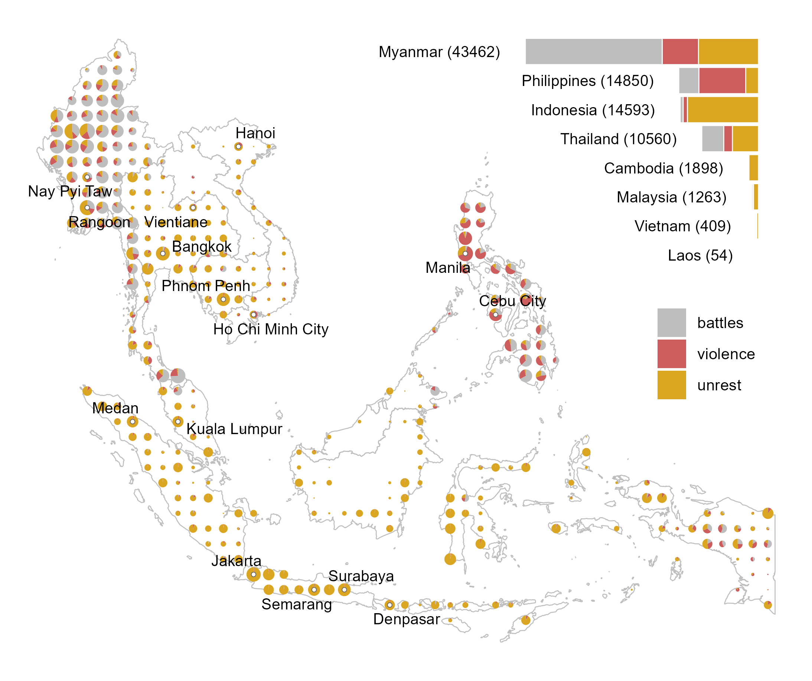
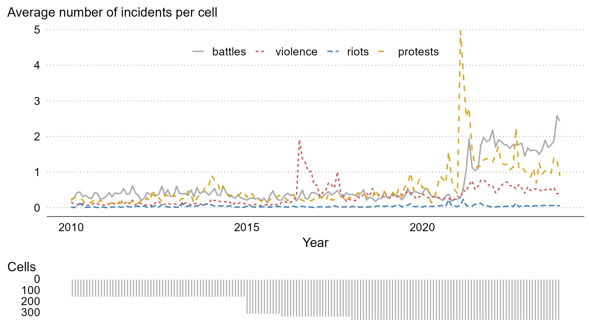
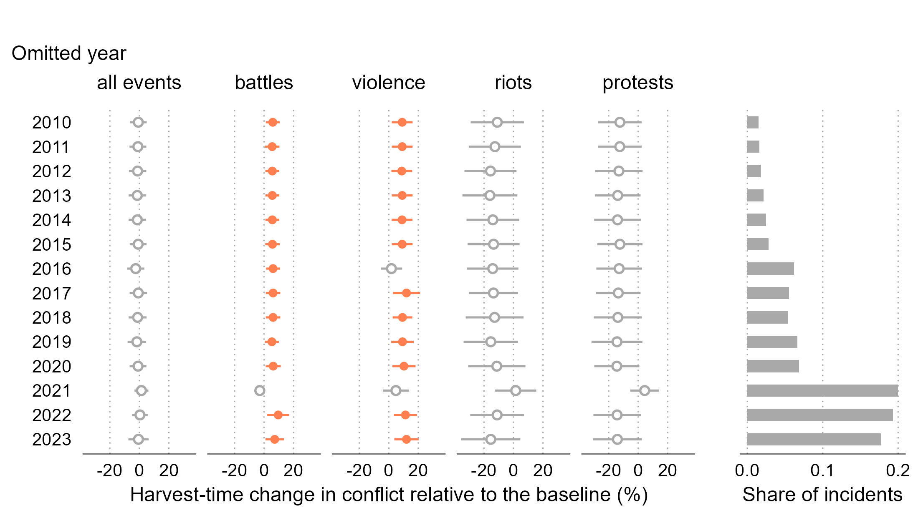

```{r setup, include=FALSE}
knitr::opts_chunk$set(echo = FALSE)
```


# Agriculture and conflict can be linked... literally

.right-90[


]

---


# Agriculture may also be linked with conflict causally

.right-90[

We focus on low- and middle-income countries of Southeast Asia, where agriculture employs and pays large shares of population. 

We ask the question:

> Do harvest-time agricultural shocks lead to changes in forms of conflict?

]


---


# More violence and less protests at harvest time

.right-90[

Relative to the rest of the year, at harvest time we estimate:
- more than ten percent increase in violence against civilians
- up to ten percent increase in battles*
- up to ten percent decrease in protests*

$$\\[.5in]$$

*sensitive to data subsetting or changes in model specification.

]


---


# Conflicts happen all across Southeast Asia

.left-50[

From the [ACLED Project](https://acleddata.com/), over 70 thousand incidents of: 
- <span style="color:dimgray">**battles**</span>, 
- <span style="color:dimgray">**explosions/remote violence**</span>, 
- <span style="color:indianred">**violence against civilians**</span>, 
- <span style="color:goldenrod">**riots**</span>, and 
- <span style="color:goldenrod">**protests**</span> 

observed over the 2010-2022 period.

]

.right-50[

]

---


# Conflicts happen all the time in Southeast Asia

.left-40[

Unbalanced panel of eight countries.

For most countries, the data are available from 2010 onward, except for:

- Indonesia (2015-)
- Philippines (2016-)
- Malaysia (2018-)

]

.right-60[

]

---


# Rice is cultivated across all of Southeast Asia

.left-50[

From IFPRI's [Spatial Production Allocation Model](https://dataverse.harvard.edu/dataset.xhtml?persistentId=doi:10.7910/DVN/PRFF8V) (SPAM) and [Monfreda et al. (2008)](https://agupubs.onlinelibrary.wiley.com/doi/10.1029/2007GB002947),
- regional variation in the sizes of harvested area
- regional variation in the timing of harvest seasons
- regional variation in the proportions of irrigated land

]

.right-50[

]

---


# Positive correlation between conflict and croplands

.left-40[

Generally positive relationship between the size of croplands and the average number of incidents in the cell

Seemingly negative relationship between these two variables in 'urban' cells

]

.right-60[

]

---


# We study the effect of harvest on forms of conflict

.right-90[

The outcome variable is the incidence of conflict in a given cell at a given period (year-month). We consider:

- all forms of conflict combined, and
- each form of conflict separately.

The treatment variable is the product of the cropland indicator (harvest area $\ge$ 10,000ha) and harvest season indicator.

Fixed effects: cell, country-year, year-month.

]

---

# Battles and violence increase and protests decrease

.left-40[

The estimated effect is evaluated at the average size of the cropland and relative to the average conflict.

The dots are point estimates, and errorbars denote 95% confidence interval.

]

.right-60[


]

---


# Myanmar is driving the results

.left-40[

This comes hardly as a surprise, since nearly half of the observations come from Myanmar.

]

.right-60[


]

---


# 2020 and 2021 are driving (some of) the results

.left-40[

Likely linked with pandemic-related restrictions in 2020, and the onset of the Myanmar conflict in 2021.

]

.right-60[



]

---


# The specification chart

.left-40[


]

.right-60[

The effect on violence robust across most specifications.

]

---


# Heterogeneity: rainfed vs irrigated

.left-40[

The harvest-time increase in violence and (statistically insignificant) decrease in protests more prominent in rainfed locations.

]

.right-60[


]

---


# Heterogeneity: rural vs urban

.left-40[

The harvest-time increase in battles and violence is a rural phenomenon.

]

.right-60[


]

---


# Harvest-time violence may be linked to rapacity

.right-90[

[Ubilava et al. (2023)](https://doi.org/10.1111/ajae.12364) investigate the effect of cereal price change on seasonal violence in the croplands of Africa.

The key finding: much of the annually accrued effect&mdash;which is positive, statistically significant, and economically meaningful&mdash;happens during the first three months of the crop year.

Accords with the *rapacity mechanism*: farmers attacked when most gains are to be made (or maximum damage incurred).

]

---


# Opportunity cost may explain less protests 

.right-90[
The *opportunity cost mechanism* often is portrayed as a trade-off a person faces between farming and fighting.

Agricultural shocks may push a person in one direction or another... but this is a longer term engagement.

In the short run, the opportunity cost mechanism is well-suited to explain the lack of protests at harvest time.

But, some of this may be offset by *resentment*, i.e., when people feel being worse off only because others are doing well.
]

---


# Mechanisms: harvest intensity

.left-50[


The harvest-time increase in battles and violence is more prominent in larger croplands.

The harvest-time decrease in protests observed in small croplands only.

]

.right-50[


]

---


# Mechanisms: harvest timing

.left-50[


The harvest-time increase in battles lingers post-harvest (possibly picking up the dry-season effect).

The harvest-time increase in violence and decrease in protests are centered on the harvest month.

]

.right-50[


]

---


# Mechanisms: harvest quality

.left-50[

The harvest-time increase in battles negatively correlated with the growing season rainfall.

The harvest-time decrease in violence, as well as protests and riots, have inverted V-shaped patterns relative to the growing season rainfall.

]

.right-50[


]

---


# We contribute to three strands of conflict literature

.right-90[

Climate shocks and conflict ([Burke et al., 2009](https://www.pnas.org/doi/pdf/10.1073/pnas.0907998106); [Hsiang et al., 2013](https://www.science.org/doi/10.1126/science.1235367); [Crost et al., 2018](https://www.sciencedirect.com/science/article/abs/pii/S0095069617301584))

Economic roots of conflict ([Berman et al, 2011](https://journals.sagepub.com/doi/10.1177/0022002710393920); [Crost and Felter, 2020](https://academic.oup.com/jeea/article/18/3/1484/5505371); [McGuirk and Burke, 2020](https://www.journals.uchicago.edu/doi/abs/10.1086/709993))

Seasonality of conflict ([Harari and La Ferrara, 2018](https://direct.mit.edu/rest/article-abstract/100/4/594/58501/Conflict-Climate-and-Cells-A-Disaggregated); McGuirk and Nunn, 2023; Guardado and Pennings, 2023; [Ubilava et al., 2023](https://doi.org/10.1111/ajae.12364))

]


